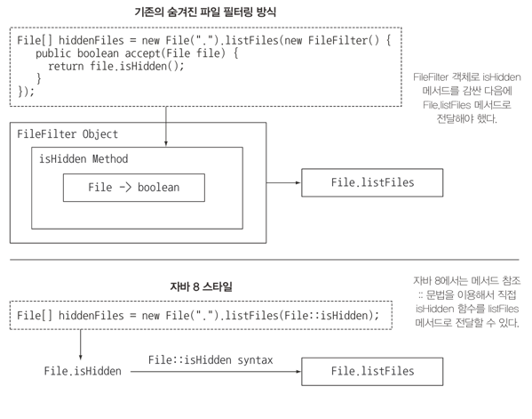

### 자바 8 이후 자바 역사 중에 가장 큰 변화가 생김  
1. 간결한 코드
```java
// 자바 8 이전
Collections.sort(inventory, new Comparator<Apple>(){
public int comapre(Apple a1, Apple a2){
        return a1.getWeight().compareTo(a2.getWeight());
        }
});

// 자바 8 이후
inventory.sort(comparing(Apple::getWeight));
```
2. 멀티코어 프로세서의 쉬운 활용  

[//]: # (TODO 스레드 공부 )
기존에 대부분의 자바 프로그램은 코어 중 하나만을 사용했다.  
기존 방식 스레드로 병렬처리 함 -> 자바 8은 병렬 실행을 새롭고 단순한 방식으로 제공(**RxJava** : 리액트 스트림 툴킷)  

자바 8의 중요한 변화
- **스트림 API**
- **메서드에 코드를 전달**하는 기법
- 인터페이스의 **디폴트 메서드**

### 스트림 처리
스트림이란 한 번에 한 개씩 만들어지는 연속적인 데이터 항목들의 모임이다.  
이론적으로 프로그램은 입력 스트림에서 데이터를 한개씩 읽어 들이며 마찬가지로 출력 스트림으로 데이터를 한 개씩 기록한다.  
즉, 어떤 프로그램의 출력 스트림은 다른 프로그램의 입력 스트림이 될 수 있다.

### 동작파라미터화
스트림 API는 연산의 동작을 파라미터화할 수 있는 코드를 전달

### 병렬성과 공유 가변 데이터
스트림 메서드로 전달하는 코드는 다른 코드와 동시에 실행하더라도 안전하게 실행될 수 있어야 한다. 
동시에 실행하더라도 안전하게 실행 할수 있는 코드를 만들려면 공유된 **가변 데이터(shared mutable data)**에 접근하지 않아야 한다.  
이러한 함수를 순수(pure) 함수, 부작용 없는(side-effect-free) 함수, 상태 없는 함수(stateless)라 부른다.  
공유된 변수나 객체가 있으면 병렬성에 문제(Ex : 두 프로세스가 공유된 변수를 동시에 바꾸는 경우)가 발생한다.  

[//]: # (TODO synchronized 공부)
기존에는 synchronized를 사용해서 공유 가변 데이터를 보호하는 규칙을 만든다. But, synchronized는 시스템에 악영향을 미친다.  
자바 8 스트림을 사용해서 쉽게 병렬성을 활용 할수 있다.
공유되지 않은 가변 데이터(no shard mutable data), 메서드, 함수 코드를 다른메서드를 전달하는 두가지 기능은 함수형 프로그래밍 패터다미의 핵심적인 사항

### 자바 함수
프로그래밍 언어에서 **함수**라는 용어는 **메서드**와 같은 의미로 사용된다.  
자바의 함수는 이에 더해 **수학적인 함수**처럼 사용되며 부작용을 일으키지 않는 함수를 의미한다.

프로그래밍 언어의 핵심을 값을 바꾸는 것. 전통적으로 프로그래밍 언어에서는 이 값을 일급값이라 부른다.  
자바 프로그래밍 언어의 다양한 구조체가 값의 구조를 표현하는데 도움이 될수 있다. 하지만 프로그램을 실행하는 동안 이러한 모든 구조체를 자유롭게 전달할 수는 없다.  
이렇게 전달할 수 없는 구조체는 이급 시민이다. 이러한 점들을 해결하기 위해서 자바 8 설계자들은 이급 시민을 일급 시민으로 바꿀 수 있는 기능을 추가했다.

### 메서드와 람다를 일급 시민으로
1. 메서드 참조
```java
// 자바 8 이전
File[] hiddenFiles = new File(".").listFiles(new FileFilter() {
    public boolean accept(File file){
        return file.isHidden(); // 숨겨진 파일 필터링
        }
});
// 자바 8 이후
File[] hiddenFiles = new File(".").listFiles(File::isHidden);
```
자바 8에서는 더이상 메서드가 이급값이 아닌 일급값 -> 기존에 객체 참조(object referenc)를 이용해 객체를 주고 받은 것처럼  
File::isHidden을 이용해서 메서드 참조를 만들어 전달할수 있게 되었다.  

2. 람다 : 익명함수
자바 8에서는 (기명 named) 메서드를 일급값으로 취급할 뿐 아니라 람다(또는 익명 함수)를 포함하여 함수도 값으로 취급할 수 있다.



[//]: # (TODO 스트림 공부)
### 스트림
거의 모든 자바 애플리케이션은 컬렉션을 만들고 활용한다.  
스트림 API를 활용하면 컬렉션 API와 다른 방식으로 데이터를 처리할 수 있다.
컬렉션의 경우 for-each 루프를 이요해서 각 요소를 반복하면서 작업을 수행 => 외부 반복(external iteration)
스트림의 경우 라이브러리 내부에서 모든 데이터가 처리됨 => 내부 반복(internal iteration)

1. 멀티 스레딩은 어렵다
 스레드 API로 멀티스레딩 코드를 구현해서 병렬성을 이용하는 것이 쉽지않다.

멀티스레딩 환경에서는 가각의 스레드는 동시에 공유된 데이터에 접근하고, 데이터를 갱신할 수 있다. 결과적으로 스레드를 잘 제어하지 못하면 원치 않는 방식으로 데이터가 바뀔 수 있다.

자바 8은 스트림을 이용하면서 컬렉션 처리시 **모호함과 반복적인 코드 문제**, **멀티코어 활용 어려움** 두가지 문제를 모두 해결했다.  
=> 필터링, 추출, 그룹화 등의 기능을 쉽게 병렬화 해준다.
스트림 API가 필터를 저리하는 과정은 포킹(CPU 별로 할일을 나눔) -> 필터(각각 자기가 맡은 영역 해결) -> 결과 합침

### 디폴트 메서드와 자바 모듈
[//]: # (TODO: 자바9 모듈?)
자바 8 -> 인터페이스를 쉽게 바꿀수 있도록 디폴트 메서드를 구현할 수있다.
자바 9 -> 모듈을 정의하는 문법을 제공해 패키지 모음을 포함하는 모듈을 정의할 수 있다.
