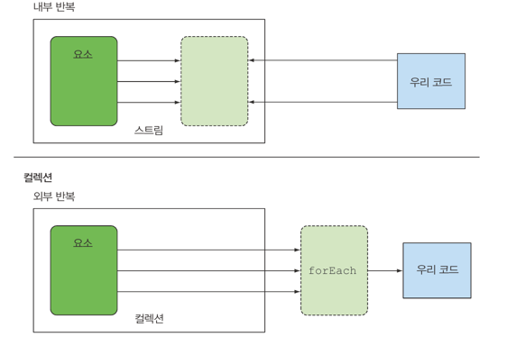

### 스트림 활용
데이터를 어떻게 처리할지 스트림 API가 관리하므로 편리하게 데이터 관련 작업을 할 수 있다.
1. 스트림 API 내부적으로 다양한 최적화가 이뤄질수있다.
2. 내부 반복뿐만 아니라 코드를 병렬로 실행할지 여부를 결정할수있음

| 연산       | 반환 형식           | 연산의 인수               | 함수 디스크립터     |  
|----------|-----------------|----------------------|--------------|
| filter   | String&lt;T&gt; | Predicate&lt;T&gt;   | T -> boolean |
| map      | String&lt;R&gt; | Function&lt;T, R&gt; | T -> R       |
| limit    | String&lt;T&gt; |                      |              |
| sorted   | String&lt;T&gt; | Comparator&lt;T&gt;  | T, T -> int  |
| distinct | String&lt;T&gt; |                      |              |

### 필터링
1. 프레디케이트를 활용한 필터링
filter -> Predicate 구현
3. 고유 요소 필터링  
distinct -> 고유요소 추출(중복제거)

### 스트림 슬라이싱
1. 프레디케이트를 이용한 슬라이싱
- takewhile -> 무한 스트림을 포함한 모든 스트림에 프레디케이트를 적용해 스트림을 슬라이스  
- dropwhile -> takewhile과 반대로 처음으로 거짓이 되는 지점까지 발견된 요소를 버린다.

2. 스트림 축소
- limit -> 최대 반환할 수 잇는 요소의 갯수

3. 요소 건너 뛰기
- skip -> 

### 매핑
1. 스트림의 각 요소에 함수 적용하기
- map -> 인수에 적용된 함수는 각 요소에 적용되며 함수를 적용한 결과가 새로운 요소로 매핑된다.

2. 스트림 평면화
- map과 Arrays.stream 사용
- flatMap 사용

### 검색과 매칭
1. 프레디케이트가 적어도 한요소와 일치하는지 확인
- anyMatch
2. 프레디케이트가 모든 요소와 일치하는지 검사
- allMatch
- noneMatch
3. 요소 검색
- filter, findAny
4. 첫번쨰 요소 찾기
- findFirst

### 리듀싱(폴드)
스트림이 하나의 값으로 줄어들 떄까지 람다는 각 요소를 반복해서 조합한다.
1. 요소의 합
.reduce(0,(a,b) -> a + b)
2. 최댓값과 최솟값
.reduce(Integer::max) .reduce(Integer::min)

장점
내부 반복이 추상화 되면서 병렬로 reduce를 실행할수있게됨
멀티스레드로 구현하면 공유하는 변수가 있기 때문에 구현하기 매우 어렵다. 스레드간의 소모적인 경쟁으로 이득이 준다.
단점
람다의 상태가 바뀌지 말아야하며, 연사이 어떤 순서로 실행되더라도 결과가 바뀌지 안흔 구조여야한다.

| 연산       | 반환 형식      | 목적                                  |  
|----------|------------|-------------------------------------|
| forEach  | void       | 스트림의 각 요소를 소비하면서 람다를 적용             |
| count    | long       | 스트림의 요소 개수를 반환한다.                   |
| collect  | Collection | 스트림을 리듀스해서 리스트, 맵, 정수 형식의 컬렉션을 만든다. |
