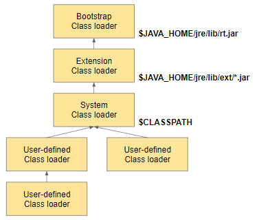
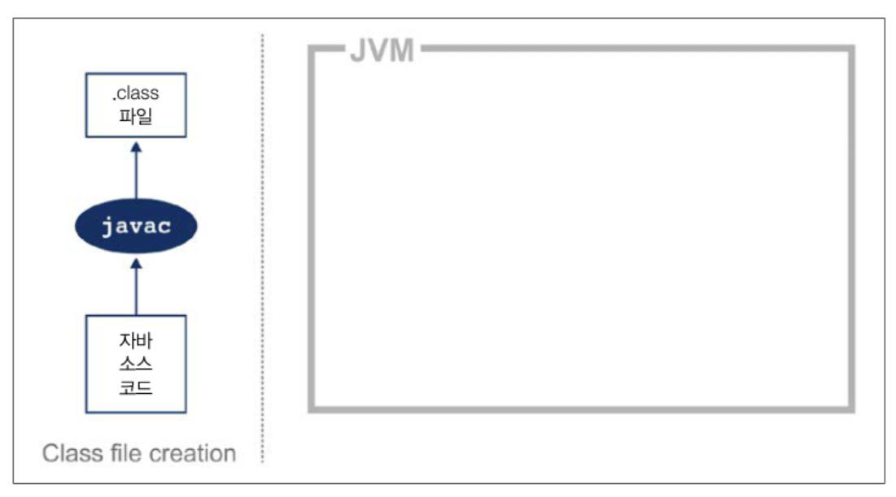
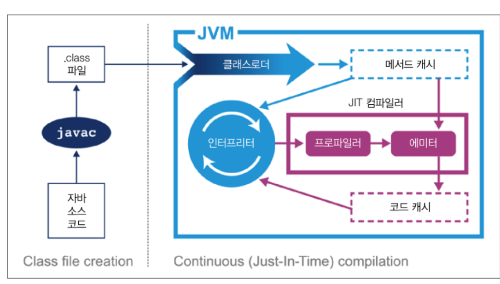

### 2.1 인터프리팅과 클래스 로딩

- JVM은 스택 기반의 해석 머신이다.
- 레지스터는 없지만 일부 결과를 실행 스택에 보관하며, 이 스택의 맨위에 쌓인 값(들)을 가져와 계산한다.
- JVM 인터프리터의 기본 로직은, 평가 스택을 이용해 중간값을 담고 가장 마지막 실행 명령어와  
독립적으로 프로그램을 구성하는 옵코드를 하나씩 순서대로 처리하는 'while 루프 안의 switch문'이라고 생각하면 된다.

- 자바 애플리케이션을 실행하면 OS는 가상 머신 프로세스를 구동한다.  
자바 가상 환경이 구성되고 스택 머신이 초기화된 다음, 실제로 유저가 작성한 HelloWord 클래스 파일이 실행된다.  

1. 부트스트랩 클래스 로더 : 다른 클래스 로더가 나머지 시스템에 필요한 클래스를 로드할 수 있게 최소한의 필수 클래스만 로드하게 해준다.
2. 확장 클래스 로더 : 부트스트랩 클래스로더를 자기 부모로 설정하고 필요할때 클래스로딩 작업을 부모에게 넘긴다.  
널리 쓰이지는 않지만 네이티브 코드를 제공하고 기본 환경을 오버라이드 할 수 있다.
3. 시스템 클래스로더(애플리케이션 클래스로더) : 처음보는 새 클래스를 디펜던시(의존체)에 로드한다.

### 2.2 바이트코드 실행

- javac의 역할은 자바 소스 코드를 바이트코드로 가득찬 .class파일로 바꾼다.(최적화를 거의 하지 않음)

### 2.3 핫스팟 입문

- 프로그램의 런타임 동작을 분석하고 성능에 가장 유리한 방향으로 영리한 최적하를 적용하는 가상 머신
- 핫스팟의 목표는 개발자가 억지로 VM 틀에 맞게 프로그램을 욱여 넣는것이 아니라, 자바코드를 자연스럽게 작성하고  
바람직한 설계 원리를 따르도록 하는 것

#### 2.3.1 JIT 컴파일?
