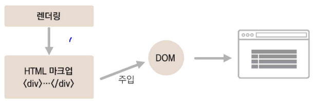
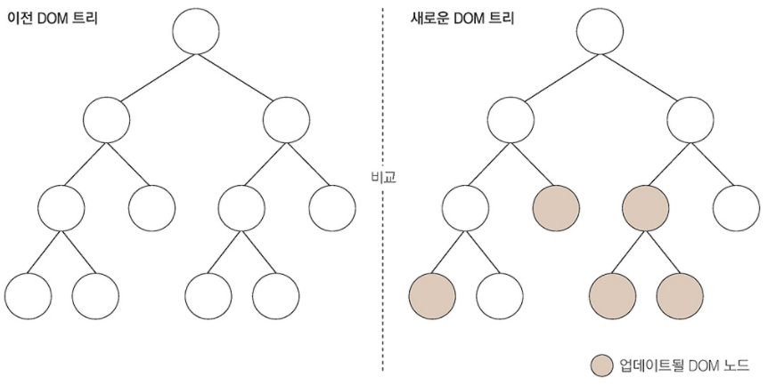
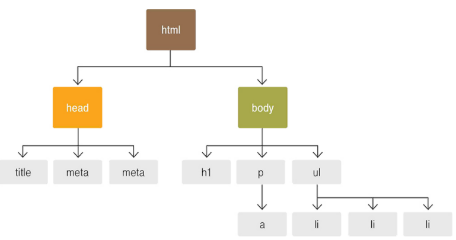
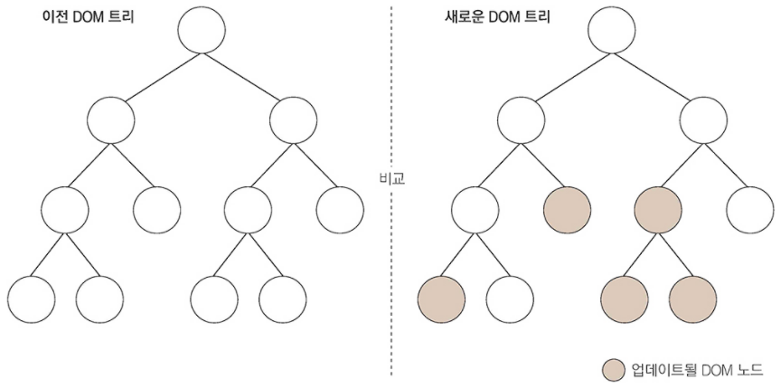

## 리액트 시작 

### 왜 리액트 인가?
리액트는 페이스북에서 개발

어떠한 데이터가 변할 때마다 기존의 뷰를 날려버리고 처음부터 새로 렌더링하는 방식

1. 리액트 이해

리액트는 자바스크립트 라이브러리로 사용자 인터페이스를 만드는 데 사용한다. 
특정 부분이 어떻게 생길지 정하는 선언체가 있는데, 이를 컴포넌트(component)라고 한다.

1.1 초기 렌더링

어떤 UI관련 프레임워크, 라이브러리를 사용하던지 간에 초기 렌더링이 필요하다. 리액트에서는 render 함수를 사용해 렌더링을한다.
render 함수는 컴포넌트가 어떻게 생겼는지 정의하는 역할

html 형식의 문자열을 반환하지 않고, 뷰에 대한 정보를 지는 객체를 반환한다. 컴포넌트 내부에는 또 다른 컴포넌트들이 들어갈 수 있다. 이때 render를 실행하면 그 안에 있는 컴포넌트들도 재귀적으로 렌더링한다.

 최상위 컴포넌트의 렌더링 작업이 끝나면 지니고 있는 정보들을 사용하여 HTML 마크업을 만들고, 이를 우리가 정하는 실제 페이지의 DOM 요소안에 주입한다.

 1.2 조화 과정
 
 리액트에서 뷰를 업데이트 할때는 "업데이트 과정을 거친다" 라고 하기 보다는 "조화 과정(reconciliation)을 거친다"라고 하는 것이 정확한 표현이다.

**실제로 동작과정에서 뷰가 변하는것이 아니라 새로운 요소로 갈아 끼워진다.**

이전에 render함수가 만들었던 컴포넌트 정보와 현재 render 함수가 만든 컴포넌트 정보를 비교한다.

## 리액트의 특징

1. Virtual DOM
   
   리액트의 주요 특징은 Virtual DOM을 사용하는 것입니다.

1.1 DOM?

JS의 Document Object Model!

HTML은 자체적으로 정적이기 떄문에 DOM의 가장 큰 문제는 동적 UI에 최적화되어 있지 않다. 

규모가 큰 애플리케이션에서는 잦은 업데이트가 발생하는데 DOM에 직접 접근하여 변화를 주다보면 성능 이슈가 발생한다.

이러한 문제를 해결하기 위해서 리액트는 **Virtual DOM 방식을 사용**해 DOM 업데이트 처리 횟수를 최소화하고 효율적으로 진행한다.

1.2 Virtual DOM

Virtual DOM을 사용하면 실제 DOM에 접근하여 조작하는 대신, 이를 추상화한 자바스크립트 객체를 구성하여 사용한다.

리액트에서 DOM을 업데이트 할 때는 세가지 절차를 밟는다.

1. 데이터를 업데이트하면 전체 UI를 Virtual DOM에 리렌더링한다.
2. 이전 Virtual DOM에 있던 내용과 현재 내용을 비교한다.
3. 바뀐 부분만 실제 DOM에 적용한다.
   

**자바스크립트를 사용해 두 가지 뷰를 최소한의 연산으로 비교한 후, 둘의 차이를 알아내 최소한의 연산으로 DOM 트리를 업데이트한다.**