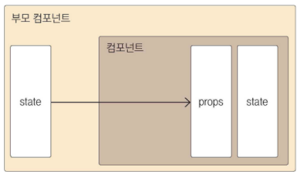

### 클래스형 컴포넌트

- 함수형 컴포넌트
```JavaScript
function App() {
   const name = '리액트';
   return <div className="react">{name}</div>;
}
```

- 클래스형 컴포넌트

```JavaScript
class App extends Component {
   render() {
      const name = 'react';
      return <div className="react">{name}</div>;
   }
}
```

클래스형 컴포넌트는 함수 컴포넌트와 다르게 state 기능 및 라이프 사이클 기능을 사용할 수 있다는 것과 임의 메서드를 정의할 수 있다는 것

클래스형 컴포넌트에서는 render 함수가 꼭 있어야 하고, 그 안에서 보여 주어야 할 JSX를 반환해야 한다.

함수형 컴포넌트는 Hooks라는 기능을 이용해 클래스형 컴포넌트 처럼 사용할 수 있다.

###  props
컴포넌트 속성을 설정할 때 사용하는 요소

1. JSX 내부에서 props 렌더링

```JavaScript
const MyComponent = props => {
   return <div> 안녕하세요, 제 이름은 {props.name} 입니다. </div>
}
```

2. 컴포넌트를 사용할 때 props 값 지정하기

```JavaScript
const App = () => {
   return <MyComponent name="React" />;
}
```

3. props 기본값 설정 : defaultProps

```JavaScript
const MyComponent = props => {
   return <div>안녕하세요, 제 이름은 {props.name}입니다.</div>
}

MyComponent.defaultProps = {
   name : '기본 이름'
};
```

4. 태그 사이의 내요을 보여 주는 children

리액트 컴포넌트 태그 사이의 내용을 보여주는 props

```JavaScript
const App = () => {
   return <MyComponent>리액트</MyComponent>;
}

// MyComponent 사이에 작성한 리액트 문자열을 확인하려면
// CASE 1
const MyComponent = props => {
   return (
      <div>
         안녕하세요, 제 이름은 {props.name}입니다. <br/>
         children 값은 {props.children} 입니다.
      </div>
   )
}

// CASE 2 - 비구조화 할당 문법
const MyComponent = ({name, children}) => {
   return (
      <div>
         안녕하세요, 제 이름은 {name}입니다. <br/>
         children 값은 {children} 입니다.
      </div>
   )
}

MyComponent.defaultProps = {
   name : '기본 이름'
};

```

5. propTypes를 통한 props 검증

컴포넌트의 필수 props를 지정하거나 props의 타입(type)을 지정할 때는 propTypes를 사용한다. 


```JavaScript
MyComponent.propTypes = {
   name : PropTypes.string,
   // isRequired를 사용해, 필수 PropTypes 설정
   requiredValue : PropTypes.number.isRequired
};

```

6. 클래스형 컴포넌트에서 props 사용하기

```JavaScript
class MyComponet extends Component {
   render() {
      const {name, favoriteNumber, children} = this.props;
      return ( {
            <div>
               안녕하세요, 제 이름은 {name}입니다. <br/>
               children 값은 {children} 입니다. <br/>
               제가 좋아하는 숫자는 {favoriteNumber} 입니다. 
            </div>
         }
      )
   }
}

MyComponent.defaultProps = {
   name: '기본 이름'
};

MyComponent.propTypes = {
   name : PropTypes.string,
   favoriteNumber : PropTypes.number.isRequired
};

// 클래스 내부에 저장
class MyComponet extends Component {
   static defaultProps = {
      name : '기본 이름'
   }

   static propTypes = {
      name: PropTypes.string,
      favoriteNumber: PropTypes.number.isRequired
   };

   render() {
      const {name, favoriteNumber, children} = this.props;
      return ( {
            <div>
               안녕하세요, 제 이름은 {name}입니다. <br/>
               children 값은 {children} 입니다. <br/>
               제가 좋아하는 숫자는 {favoriteNumber} 입니다. 
            </div>
         }
      )
   }
}
```


### state
state는 컴포넌트 내부에서 바뀔 수 있는 값을 의미한다.

```JavaScript
class Counter extends Component {
   constructor(props) {
      super(props);
      // state의 초기값 설정
      this.state = {
         number : 0
      };
   }

   render() {
      const { number } = this.state;
      return (
         <div>
            <h1>{number}</h1>
            <button
               // onClick을 통해 버튼이 클릭되었을 때 호출할 함수를 지정한다.
               onClick = {() => {
               // this.setState를 사용하여 state에 새로운 값을 넣을 수 있다.
               this.setState({number : number + 1});
               }}
            >
            +1
            </button>
         </div>
      )
   }
}
```

함수 컴포넌트에서는 state를 사용 할 수 없었지만, 리액트 16.8 이후 useState라는 함수를 사용하여 함수 컴포넌트에서도 사용가능하게 되었다.

```JavaScript
impoert React, {useState} from 'react';

const Say = () => {
   const [message, setMessage] = useState('');
   const onClickEnter = () => setMessage('안녕하세요');
   const onClickLeave = () => setMessage('안녕히 가세요');

   return (
      <div>
         <button onClick={onClickEnter}>입장</button>
         <button onClick={onClickLeave}>퇴장</button>
         <h1>{message}></h1>
      </div>
   )
}
```


### props와 state의 차이



둘 다 컴포넌트에서 사용하거나 렌더링할 데이터를 담고 있다는 점에서는 같다. 하지만 props는 **부모 컴포넌트가 설정**하고, state는 **컴포넌트 내부에서 값을 업데이트** 할 수 있다.