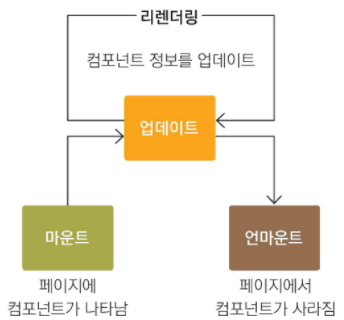

### 라이프사이클 메서드의 이해

라이프사이클의 카테고리
1. 마운트   

 
DOM이 생성되고 웹 브라우저상에 나타는 것 
- constructor : 컴포넌트를 새로 만들 때마다 호출되는 클래스 생성자 메서드
- getDerivedStateFromProps : props에 있는 값을 state에 넣을 때 사용하는 메서드
- render : 우리가 준비한 UI를 렌더링하는 메서드
- componentDidMount : 컴포넌트가 웹 브라우저상에 나타난 후 호출하는 메서드

2. 업데이트
  
컴포넌트가 업데이트 되는 경우는
  1. props 변경
  2. state 변경
  3. 부모 컴포넌트가 리렌더링될 때
  4. this.forceUpdate로 강제로 렌더링을 트리거할 떄

 
업데이트 호출할때 사용하는 메서드
- getDerivedStateFromProps : 이 메서드는 마운트 과정에서도 호출되며, 업데이트가시작하기 전에도 호출됩니다. props의 변화에 따라 state 값에도 변화를 주고 싶을 때 사용
- shouldComponentUpdate : 컴포넌트가 리렌더링을 해야 할지 말아야 할지를 결정하는 메서드입니다. boolean값을 리턴하며 이를 통해서 다음 step 실행 판단
- render : 컴포넌트를 리렌더링
- getSnapShotBeforeUpdate : 컴포넌트 변화를 DOM에 반영하기 바로 전에 호출
- componentDidUpdate : 컴포넌트의 업데이트 작업이 끝난 후 호출

3. 언마운트

 

마운트의 반대과정, 즉 컴포넌트를 DOM에서 제거\
- componentWullUnmount : 컴포넌트가 우베 브라우저상에서 사라지기 전에 호출하는 메서드입니다.

### 라이프사이클 메서드

1. render()

컴포넌트 모양새를 정의한다. 이 메서드 안에서 this.props와 this.state에 접근할 수 있으며, 리액트 요소를 반환한다. 요소는 div 같은 태그가 될 수도 있고, 따로 선언한 컴포넌트가 될 수도 있다.

2. constructor

컴포넌트 생성자의 메서드로 컴포넌트를 만들 떄 처음으로 실행된다. 초기 state를 정할 수 있습니다.

3. getDerivedStateFromProps
   
props로 받아 온값을 state에 동기화시키는 용도로 사용, 컴포넌트가 마운트될 때와 업데이트될 떄 호출

4. componentDidMount
   
컴포넌트를 만들고, 첫 렌더링을 다 마친 후 실행합니다. 자바스크립트 라이브러리 또는 프레임워크의 함수를 호출하거나 이벤트 등록, setTimeout, setInterval, 네트워크 요청

5. shouldComponentUpdate
   
props 또는 state를 변경했을 때, 리렌더링을 시작할지 여부를 지정하는 메서드. 이 메서드 안에서 현재 props와 state는 this.props와 this.state로 접근하고, 새로 설정될 rpops 또는 state는 nextProps와 nextState로 접글할 수 있습니다.

6. getSnapshotBeforeUpdate
  
render에서 만들어진 결과물이 브라우저에 실제로 반영되기 직전에 호출된다. 반환 값은 componentDisUpdate에서 세 번째 파라미터인 snapshot 값으로 전달 받을 수 있다. **주로 업데이트 직전의 값을 참고할 때 사용**

7. componentDidUpdate
   
리렌더링을 완료한 후 실행한다. prevProps 또는 prevState를 사용하여 컴포넌트가 이전에 가졌던 데이터에 접글할 수 있다.

8. componentWillUnmount
   
컴포넌트를 DOM에서 제거할 때 실행한다. componentDidMount에서 등록한 이벤트, 타이머, 직접 생성한 DOM 있다면 여기서 제거 작업을 한다.

9. componentDidCatch

컴포넌트 렌더링 도중에 에러가 발생했을 때 애플리케이션이 먹통이 되지않고 오류 UI를 보여 줄 수 있게 해준다.
